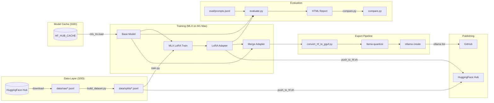
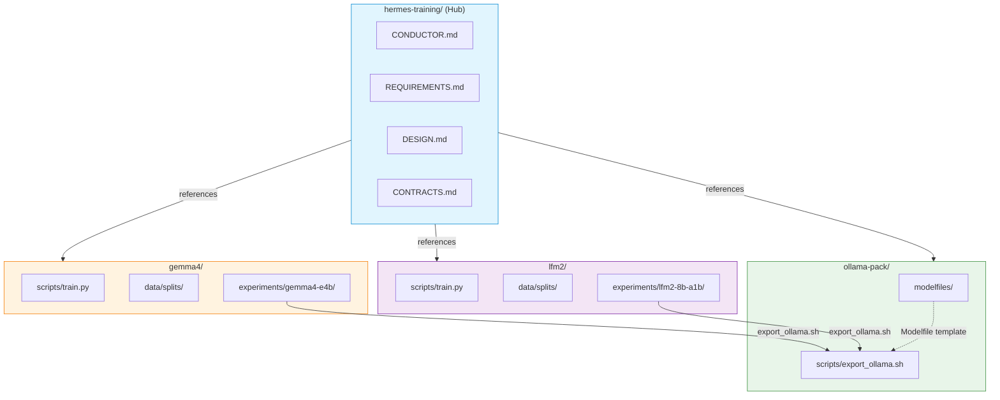
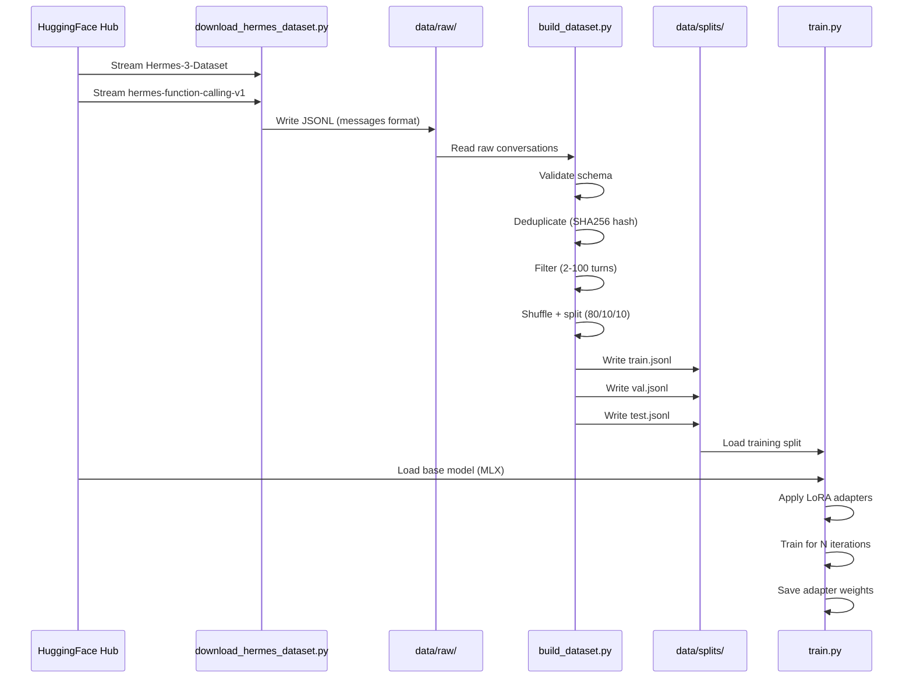
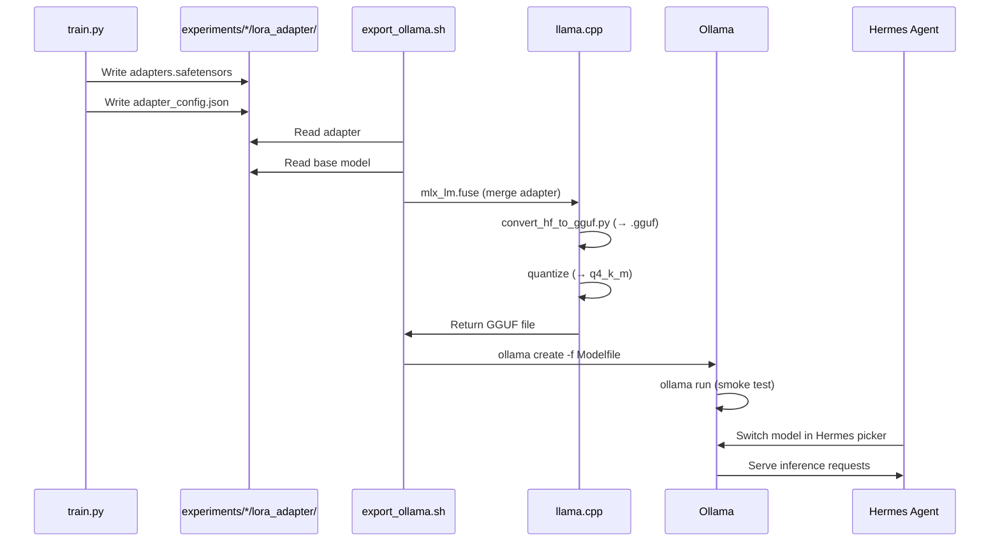
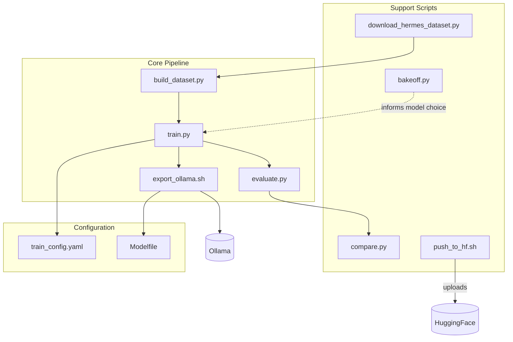
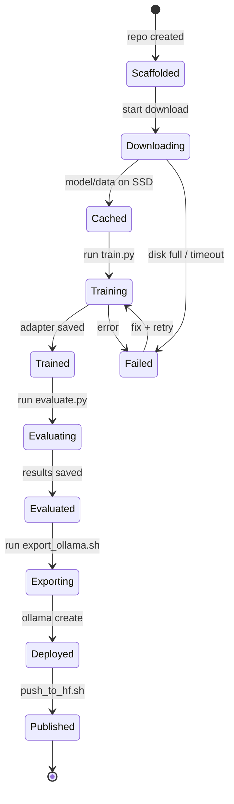
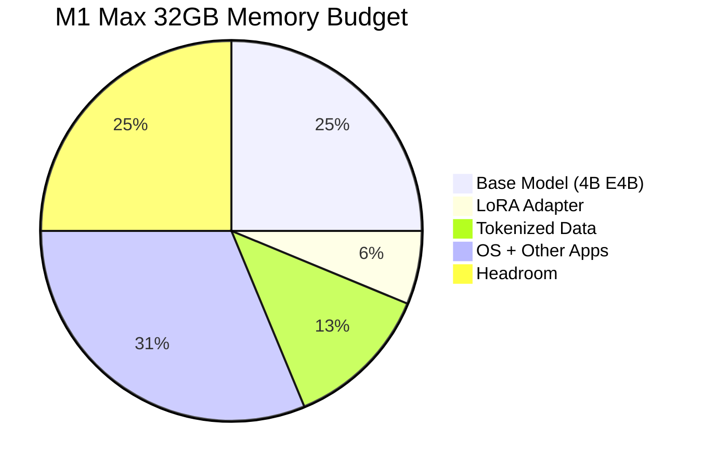

# Design — Hermes Training Hub Architecture

> **Status:** Active
> **Version:** 1.0
> **See also:** `REQUIREMENTS.md` for MoSCoW, `CONTRACTS.md` for interface contracts

---

## 1. Pipeline Architecture



## 2. Repository Dependency Graph



## 3. Training Data Flow



## 4. Deployment Flow



## 5. Component Architecture



## 6. File Relationship Map

```mermaid
flowchart LR
    CONFIG[train_config.yaml] -->|parameters| TRAIN[train.py]
    RAW[data/raw/*.jsonl] -->|input| BUILD[build_dataset.py]
    BUILD -->|output| SPLITS[data/splits/*.jsonl]
    SPLITS -->|training data| TRAIN
    HF_MODEL[Base model (HF)] -->|mlx_lm.load| TRAIN
    TRAIN -->|produces| ADAPTER[experiments/*/lora_adapter/]
    ADAPTER -->|input| EVAL[evaluate.py]
    PROMPTS[eval/prompts.jsonl] --> EVAL
    EVAL -->|output| RESULTS[eval/results.jsonl]
    EVAL -->|generates| REPORT[eval/report.html]
    ADAPTER -->|input| COMPARE[compare.py]
    COMPARE -->|generates| COMP_HTML[eval/comparison.html]
    ADAPTER -->|input| EXPORT[export_ollama.sh]
    EXPORT -->|converts| GGUF[*.gguf]
    GGUF -->|ollama create| OLLAMA_MODEL[Ollama model]
    ADAPTER -->|input| PUSH[push_to_hf.sh]
    PUSH -->|uploads| HF[HuggingFace]
```

## 7. State Machine



## 8. Hardware Resource Budget



| Resource | Available | Allocated | Notes |
|----------|-----------|-----------|-------|
| RAM | 32 GB | ~8 GB model + ~4 GB data | 4B MoE fits comfortably |
| Disk (SSD) | 743 GB | ~50 GB for models + datasets | Ample space for 5+ models |
| Disk (internal) | 13 GB free | ~1 GB for code | Code repos are small |
| CPU cores | 10 (8P+2E) | 4 for training | MLX uses ANE + GPU primarily |
| GPU cores | 24 | 24 | MLX uses Metal GPU |
