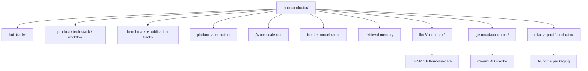
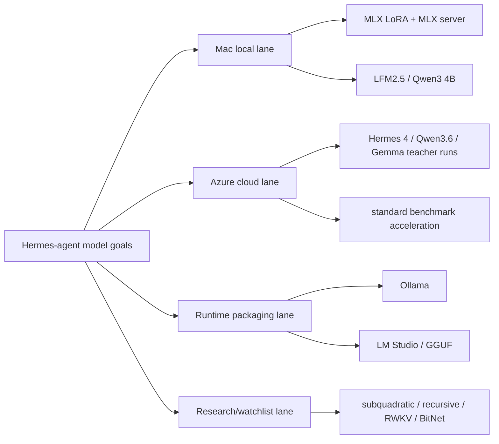
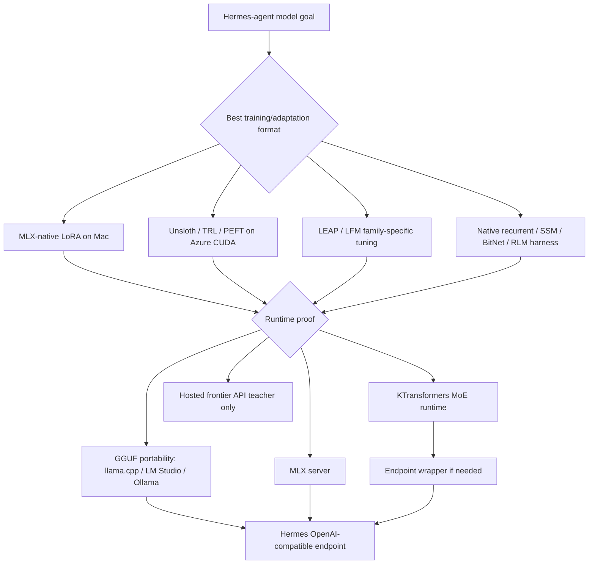
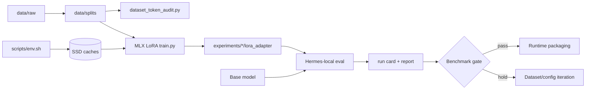
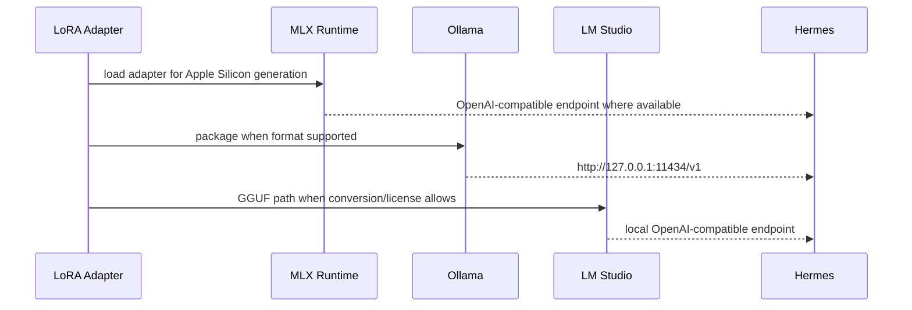
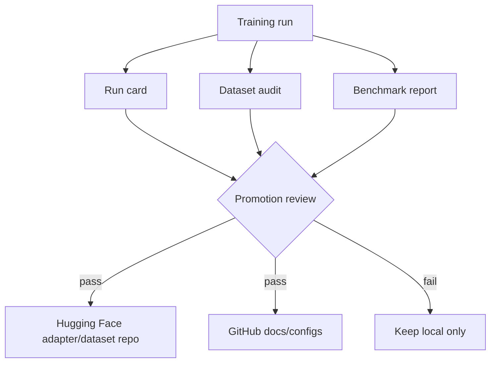
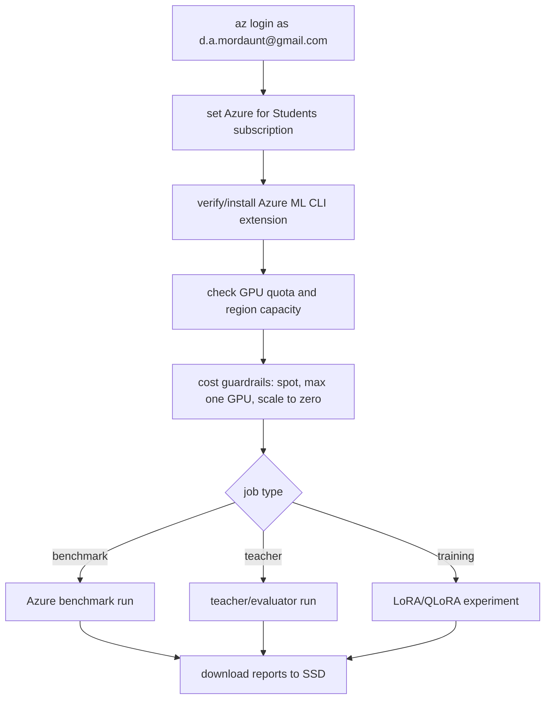

# Design — Hermes Training Hub

## Conductor Organization And Platform Lanes

```mermaid
flowchart TD
    HUB[hub conductor/] --> HTRACKS[hub tracks]
    HUB --> DOCS[product / tech-stack / workflow]
    HUB --> BENCH[benchmark + publication tracks]
    HUB --> PLAT[platform abstraction]
    HUB --> AZURE[Azure scale-out]
    HUB --> RADAR[frontier model radar]
    HUB --> RETR[retrieval memory]

    HUB --> LFM[lfm2/conductor/]
    HUB --> GQ[gemma4/conductor/]
    HUB --> OP[ollama-pack/conductor/]

    LFM --> LFMTRACK[LFM2.5 full-smoke-data]
    GQ --> QTRACK[Qwen3 4B smoke]
    OP --> RTRACK[Runtime packaging]
```

```mermaid
flowchart LR
    PURPOSE[Hermes-agent model goals] --> LOCAL[Mac local lane]
    PURPOSE --> CLOUD[Azure cloud lane]
    PURPOSE --> RUNTIME[Runtime packaging lane]
    PURPOSE --> RESEARCH[Research/watchlist lane]

    LOCAL --> MLX[MLX LoRA + MLX server]
    LOCAL --> SMALL[LFM2.5 / Qwen3 4B]
    CLOUD --> TEACHER[Hermes 4 / Qwen3.6 / Gemma teacher runs]
    CLOUD --> BENCHC[standard benchmark acceleration]
    RUNTIME --> OLLAMA[Ollama]
    RUNTIME --> LM[LM Studio / GGUF]
    RESEARCH --> SUBQ[subquadratic / recursive / RWKV / BitNet]
```

```mermaid
flowchart TD
    GOAL[Hermes-agent model goal] --> TRAINFMT{Best training/adaptation format}
    TRAINFMT --> MLX[MLX-native LoRA on Mac]
    TRAINFMT --> UNSLOTH[Unsloth / TRL / PEFT on Azure CUDA]
    TRAINFMT --> LEAP[LEAP / LFM family-specific tuning]
    TRAINFMT --> NATIVE[Native recurrent / SSM / BitNet / RLM harness]

    MLX --> PROOF{Runtime proof}
    UNSLOTH --> PROOF
    LEAP --> PROOF
    NATIVE --> PROOF

    PROOF --> MLXRT[MLX server]
    PROOF --> KTRANS[KTransformers MoE runtime]
    PROOF --> GGUF[GGUF portability: llama.cpp / LM Studio / Ollama]
    PROOF --> HOSTED[Hosted frontier API teacher only]

    GGUF --> HERMES[Hermes OpenAI-compatible endpoint]
    MLXRT --> HERMES
    KTRANS --> WRAP[Endpoint wrapper if needed]
    WRAP --> HERMES
```

## Training and Evaluation Flow

```mermaid
flowchart LR
    ENV[scripts/env.sh] --> CACHE[(SSD caches)]
    RAW[data/raw] --> SPLITS[data/splits]
    SPLITS --> AUDIT[dataset_token_audit.py]
    SPLITS --> TRAIN[MLX LoRA train.py]
    CACHE --> TRAIN
    TRAIN --> ADAPTER[experiments/*/lora_adapter]
    ADAPTER --> EVAL[Hermes-local eval]
    BASE[Base model] --> EVAL
    EVAL --> REPORT[run card + report]
    REPORT --> GATE{Benchmark gate}
    GATE -->|pass| PACKAGE[Runtime packaging]
    GATE -->|hold| ITERATE[Dataset/config iteration]
```

## Runtime Flow

```mermaid
sequenceDiagram
    participant Adapter as LoRA Adapter
    participant MLX as MLX Runtime
    participant Ollama as Ollama
    participant LM as LM Studio
    participant Hermes as Hermes

    Adapter->>MLX: load adapter for Apple Silicon generation
    MLX-->>Hermes: OpenAI-compatible endpoint where available
    Adapter->>Ollama: package when format supported
    Ollama-->>Hermes: http://127.0.0.1:11434/v1
    Adapter->>LM: GGUF path when conversion/license allows
    LM-->>Hermes: local OpenAI-compatible endpoint
```

## Publication Flow

```mermaid
flowchart TD
    RUN[Training run] --> CARD[Run card]
    RUN --> DATASET[Dataset audit]
    RUN --> BENCH[Benchmark report]
    CARD --> REVIEW{Promotion review}
    DATASET --> REVIEW
    BENCH --> REVIEW
    REVIEW -->|pass| HF[Hugging Face adapter/dataset repo]
    REVIEW -->|pass| GH[GitHub docs/configs]
    REVIEW -->|fail| LOCAL[Keep local only]
```

## Azure Scale-Out Gate

```mermaid
flowchart TD
    LOGIN[az login as d.a.mordaunt@gmail.com] --> SUB[set Azure for Students subscription]
    SUB --> EXT[verify/install Azure ML CLI extension]
    EXT --> QUOTA[check GPU quota and region capacity]
    QUOTA --> COST[cost guardrails: spot, max one GPU, scale to zero]
    COST --> JOB{job type}
    JOB -->|benchmark| BENCHA[Azure benchmark run]
    JOB -->|teacher| TEACHA[teacher/evaluator run]
    JOB -->|training| TRAINA[LoRA/QLoRA experiment]
    BENCHA --> SYNC[download reports to SSD]
    TEACHA --> SYNC
    TRAINA --> SYNC
```
